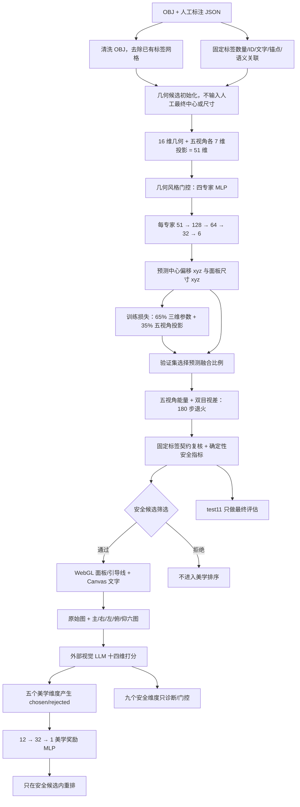

# 固定标签五视角模型：架构与第一轮训练（2026-09-18）

> 本文前半部分是基础布局 MLP 与第一轮监督训练记录。LLM 偏好部分已在 2026-09-19 更新为“确定性安全门控 + 十四维视觉评分 + `12→32→1` 美学奖励”；与旧八维、`36→32→1` 或“几何能量改善 1%”描述冲突时，以本文更新段落和 [美学偏好与几何安全职责分离](美学偏好与几何安全职责分离_2026-09-19.md) 为准。

## 系统架构图

固定的是人工标注中每个标签的顺序、ID、文字、锚点和 sourceObjs/targetGroups；优化变量为中心和尺寸。人工调整后的中心和尺寸只作监督目标，不进入 v4 候选输入。没有人工 JSON 的自定义 OBJ 仍采用几何候选，不能宣称自动发现了人工标签。

## 网络构成与依据

数据共 55 个样本，train/val/test 按类别分层为 33/11/11。沿用原有四风格（balanced、elongated、dense、symmetric）门控，采用四个独立小型 MLP 专家，避免在小数据集上虚称训练了 GNN/CNN/Transformer。每专家使用 51 → 128 → 64 → 32 → 6，前 16 维为三维几何、由固定文字长度与物体尺度初始化的标签尺寸及候选索引，五视角各增加锚点 xy、初始中心 xy、深度、面板宽高 7 维。输出 3 维相对于固定锚点的中心偏移和 3 维面板尺寸。

当前活动的 v2 模型训练时使用人工布局的三维参数 MSE，但历史候选把人工最终 `box_size` 带入网络输入，存在尺寸目标泄漏。2026-09-18 新训练的 v4 候选保持相同网络结构，移除人工最终中心和尺寸对输入的影响，并采用 65% 三维参数 MSE + 35% 五视角投影 MSE；投影项对主、右、左、俯、仰五个视角分别比较中心 xy，以及由三维标签盒 8 个角点投影得到的宽、高，共 20 个投影量。梯度仅使用 train，最佳 epoch 仅由 val 联合损失选择。后续五视角能量仍是非可微退火解码器，并非端到端图像 CNN 损失。

## 无泄漏 v4 完整训练与门控结论

v4 使用 80 epoch、学习率 0.003、权重衰减 0.0001、seed 17，train/val/test 标签实例为 248/80/78。联合损失分别为 0.505478/0.427387/0.560793；三维 MSE 为 0.438027/0.489623/0.402527；五视角投影 MSE 为 0.630746/0.311805/0.854716。模型与报告分别为 `experiments/layout_model_provenance_safe_candidate.json`、`experiments/layout_training_provenance_safe_report.json`。

所有比较均改用不含人工最终中心/尺寸的同一输入协议。val11 五视角能量（越低越好）为无模型 2.381636、旧 v2 2.271909、v4 2.246909；val 选择 `center_blend=0`、`size_blend=0.15`，比旧 v2 改善约 1.10%。门控决定之后，test11 一次确认分别为 2.386455、2.392636、2.537273；v4 比旧 v2 恶化约 6.04%。因此文件中的 val 门控状态为 accepted，但 v4 没有激活，不能声称总体或测试集性能提高，也不能用 test11 反向搜索参数。

`npm run test:layout-provenance` 已对 55 个样本、406 个标签证明：改变人工最终中心和尺寸后，候选及全部 51 维输入逐项不变，而六维监督目标随之变化。`npm run audit:fixed-labels -- --model experiments/layout_model_provenance_safe_candidate.json` 已证明候选、推理、优化三阶段的数量、顺序、ID、原文、锚点和语义关联保持一致。

五视角能量由重叠、越界、引导线交叉、物体遮挡、锚点距离、视角差异、双目视差构成；权重分别为 3.2、4.5、1.8、3.5、0.12、2.4、2.8。深度栅格分别从主、右、左、俯、仰五视角构建。这些是工程代理指标，不等于论文原评测器或头显双目实测。

## 已完成的训练和测试

80 epoch，学习率 0.003，seed 17；train/val/test 的标签实例数为 248/80/78。MSE 分别为 0.436439/0.466599/0.386230；test 的常数预测基线为 0.401179。直接全量采用网络输出时五视角指标变差，因此仅使用 val 比较 35 种融合比例，选取中心 0.10、尺寸 0.60，尺寸范围限制为人工初始尺寸的 0.65–1.35 倍。test 没参与超参数选择。

| 固定标签 test11，seed17，180 步退火 | 无布局模型 | 原 v1 MLP | 新 v2 + val 门控 |
| --- | ---: | ---: | ---: |
| 五视角能量（越低越好） | 2.458545 | 2.974364 | 2.397545 |
| 平均 OLR（越低越好） | 0.183000 | 0.333091 | 0.174818 |
| 最差 OLR（越低越好） | 0.338909 | 0.509455 | 0.303636 |
| 引导线交叉 LCD（越低越好） | 0.037455 | 0.022545 | 0.044909 |
| 物体遮挡比例（越低越好） | 0.259364 | 0.402727 | 0.291545 |
| 五视角越界比例（越低越好） | 0.038091 | 0.001909 | 0.024727 |

val 五视角能量从 2.423818 降到 2.137273（约 11.8%）；test 从 2.458545 降到 2.397545（约 2.5%）。部分单项指标变差，不能将总能量改善等同于所有视觉体验改善。55 个样本的 406 个标签均已在候选生成、神经网络推理及布局退火三阶段通过 ID、文字、锚点与语义关联审计（命令 npm run audit:fixed-labels）。报告见 experiments/layout_training_multiview_report.json、experiments/multiview_audit.json、experiments/multiview_inference_selection.json。

## v3 五视角投影损失候选（未激活）

完整 80 epoch 已训练并保存为 `experiments/layout_model_multiview_projection_candidate.json`，报告为 `experiments/layout_training_multiview_projection_report.json`。联合损失 train/val/test 为 0.505478/0.427394/0.560797；其中三维 MSE 为 0.438026/0.489633/0.402532，五视角投影 MSE 为 0.630745/0.311809/0.854717。

仅用 val 搜索 35 组融合比例后，候选选择中心融合 0.20、尺寸融合 0；val 五视角能量为 2.207909，优于无模型 2.423818，但差于当前活动 v2 的 2.137273。固定配置在 test11 上为 2.443818，同样差于活动 v2 的 2.397545。因此候选被标记为 `rejected`，没有覆盖 `experiments/layout_model.json`。详细门控见 `experiments/multiview_projection_inference_selection.json`。

门控规则已收紧：候选必须在 val 上同时比无模型和当前活动模型至少改善 1%，才允许网页训练接口备份并替换活动模型。test11 不参与融合比例、损失权重或是否激活的决定。

## 保留已有模型与操作

原模型保留为 experiments/layout_model_before_multiview.json 和 experiments/layout_model_before_multiview_activation_20260918-150530.json；当前活动模型为 experiments/layout_model.json，v2 实验文件为 experiments/layout_model_multiview.json。现在命令行及网页的新训练均写入 experiments/layout_model_multiview_projection_candidate.json，报告写入 experiments/layout_training_multiview_projection_report.json，独立于旧 v2 文件。只有候选通过相对“无模型 + 当前活动模型”的双重 val 门控后，才会先备份旧活动模型再激活。此前的 layout_model_round1.json 与 model-v1.json 也未删除。网页“训练布局模型”按钮执行训练 → val 双重门控 → 备份旧模型 → 激活；门控失败时保留旧模型。

命令：npm run train:layout 只输出新候选；npm run select:multiview 完成 val 融合搜索及 test 确认；npm run audit:multiview 检查 55 个固定标签集合和 test11 三模型比较。批量导出示例：npm run artifacts -- --split test --output experiments/artifacts/fixed-multiview。

## GPT 接入与偏好轮的真实边界

在网页输入完整 Responses API 地址、支持图片和结构化 JSON 的模型 ID，以及新 API Key；密钥只保存在本地服务端进程内存。此前聊天中暴露的 API Key 必须撤销并替换，不要复用。每候选发送“原始模型 + 主/右/左/俯/仰布局”共六张带标签文字的合成 JPEG。系统先扩展本地候选并执行成对确定性安全门控，只把最多 4 个安全候选发给外部模型；十四维评分中的五个美学维度产生 chosen/rejected，九个安全维度只作诊断和防退化检查。训练本地 `12→32→1` 美学奖励网络并只在安全候选内重排，不会直接反向更新基础布局 MLP。服务端和训练器都排除 val/test 偏好更新。

偏好轮保存有效比较并更新奖励模型后，自动只用 test11 推理：比较 seed17 固定布局与 seeds17–20 经偏好奖励网络重排选出的布局，输出 experiments/preference_test11_report.json。网页也可点击“在 test11 评估偏好效果”单独复评，命令行为 npm run evaluate:preference-test。此处使用测试样本计算候选分数进行部署式推理，但不将测试样本写入偏好训练或 val 门控。

本地模拟 Responses 与 Chat Completions 继续用于无费用回归测试；模拟数值不能作为实验结论。2026-09-18 的旧八维协议曾完成 24 次真实评分和 15 条非平局偏好，但其 `36→32→1` 混合目标奖励候选被拒绝，且不能与当前十四维美学协议合并。当前正式结论必须来自新的 0/1/2/4/8 轮独立运行、完整 val11 视觉评分和冻结检查点。旧实验详情见 `真实LLM偏好学习报告_2026-09-18.md`。

浏览器与合成 JPEG 已绘制标签文字，导出的标签 JSON 含原始精确文本；单独导出的 OBJ 仅有面板与引导线几何，不包含字体贴图，第三方 OBJ 阅读器若需显示文字，还需要额外的材质纹理/UV 导出。

## 第三方 Chat Completions 接入（2026-09-18 更新）

用户提供的 `https://api-slb.krill-code.net/codex/v1` 是 OpenAI Python SDK 的 `base_url`，对应完整接口为 `https://api-slb.krill-code.net/codex/v1/chat/completions`。本轮有权限且通过真实六图测试的模型 ID 为 `gpt-5.6-luna`；旧 `codex-auto-review` 曾返回通道权限不足。项目同时支持 `/responses` 和 `/chat/completions`，网页允许输入完整地址，或输入 `/v1` 结尾的 base_url 后自动补全。不会将另一个主机的环境 Key 或内存 Key 转送到新端点。

项目根目录的 `.venv-ai` 已安装 OpenAI Python SDK；`scripts/check-chat-sdk.py` 默认只检查导入，`--live` 才发文本请求。评分主程序是 Node 本地服务，用同一兼容协议把原始图及五视角图片共六张传给评分接口，并严格要求十四维 JSON 分数及说明。LLM 偏好保存需要服务端签发的临时凭据，绑定样本、布局、策略、五视角指标和真实 GPT 分数；更改任何字段会被拒绝。离线训练重新读取 manifest 的 train 人工调整后 JSON，并核对固定标签与锚点。

网页“测试六图与 JSON”按钮：保存当前 URL、模型和本地 Key 后，向已配置接口发送一次数据集 train 样本的六张真实参考 PNG，并校验完整十四维 JSON；不生成评分凭据，也不写入评价、偏好训练或测试数据。测试可能产生 API 费用，只能证明接口接受图像输入格式和输出结构，不能证明模型真正理解画面。正式偏好轮仍发送由模型实际生成的六张带文字布局图；未通过当前十四维真实连接测试时，不得启动或宣称完成新的真实 GPT 偏好训练。

每次自动偏好学习会生成独立 `run_id`。`run_id` 被纳入评分指纹，并同时绑定候选、服务端评分凭据和偏好记录；旧轮评分不能挪入新轮。奖励训练使用 `source=llm + run_id` 双重过滤，只读取本轮由服务端签发不同 receipt 的 train 偏好，不混入历史 LLM 轮或人工 A/B。训练结束后写出 `experiments/llm_preference_run_<run_id>.json` 和 `experiments/llm_preference_run_latest.json`，记录评分端点（不含 Key）、模型、receipt/response ID、偏好对数量、`12→32→1` 奖励网络训练摘要、逐轮冻结检查点及 test11 对照。

奖励网络采用“安全不退化 + 美学提升”门控：训练先写入 `experiments/preference_model_candidate.json`，对 val11 的每个样本生成 seeds 17–20 四个布局，先过滤不满足安全条件的候选，再比较美学奖励。完整十四维 val11 评分存在时以真实五维美学综合分选择；视觉评分不完整时只能使用候选自身美学代理，不能用旧混合质量分冒充美学。通过门控才备份并替换 `experiments/preference_model.json`；test11 在决定之后只做最终确认，不能反过来改变激活决定。

可不产生外部请求的验证：`npm run test:scoring` 测六图消息、结构化十四维输出、授权头、安全阻断、缺图错误和凭据绑定；`npm run test:preference` 验证安全门控、`12→32→1` 奖励训练、冻结检查点和 val/test 隔离。在网页选择 train 样本、设置候选/轮数并点击“运行 LLM 偏好学习”才会产生对外 API 请求和费用。奖励输入是 12 个候选自身美学统计，不含遮挡、穿模、越界、总能量或人工最终坐标。奖励模型只用于安全候选重排，不是基础布局 MLP 的梯度微调；测试集只用于最终评估。

安全提醒：聊天中先前公开的 API Key 应撤销重建。第三方提供商不是 OpenAI 官方服务，不应将其模型名理解为本对话中助手的身份；在填写 Key 和发送包含模型视图的图片前，请确认第三方的权限、数据处理政策和多模态支持。
