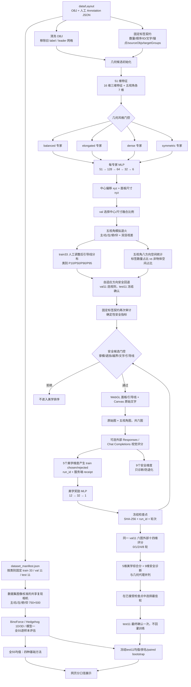

# 程序架构图与本地运行边界

> 当前实现状态：2026-09-20。基础布局部分仍由本文说明；偏好部分已升级为“方向自由空间自适应回退 + 确定性几何安全门控 + LLM 美学奖励”，职责定义见 [美学偏好与几何安全职责分离](美学偏好与几何安全职责分离_2026-09-19.md)。旧 49 维混合奖励和旧八维加权不属于当前运行协议。正在运行的实验只有通过完整 val/test 审计后才可称为最终模型。

## 系统架构



## 布局网络与损失

数据集原文件可以核实五个视角名称和 750×500 图像尺寸，但没有原始焦距、视图矩阵或投影矩阵。因此所有方法统一使用 BinoForce/Hedgehog 复现代码中的相机参数，并以 train 图像的引导线标注校准、用 val/test 图像检验；这属于**同口径复现相机**，不是声称恢复了不可获得的原始相机真值。参数来源及逐视角误差见 `experiments/dataset_camera_protocol.json` 和 `experiments/dataset_camera_calibration.json`。

活动模型为 `experiments/layout_model.json`，版本 `layout_model_v2_multiview`。无泄漏候选为 `experiments/layout_model_provenance_safe_candidate.json`，版本 `layout_model_v4_multiview_provenance_safe`。两者结构均为四个 `51→128→64→32→6` MLP 专家。输入前 16 维描述固定标签契约、锚点、物体边界和候选索引；其余 35 维来自主、右、左、俯、仰五个视角，每个视角包含锚点 xy、初始中心 xy、深度和面板宽高。输出 6 维分别为相对固定锚点的中心偏移 xyz 和面板尺寸 xyz。

活动 v2 使用三维布局参数 MSE，但历史输入候选包含人工最终 `box_size`，因此尺寸回归存在目标信息泄漏，只保留用于历史复现。v4 从 clean OBJ 几何、固定锚点和标签文字长度初始化候选；人工调整后的 `label.center`、`label.box_size` 只进入监督目标，不进入 51 维输入。v4 使用 `65% 三维参数 MSE + 35% 五视角投影 MSE`，其中每个视角比较中心 xy、投影框宽度和高度。训练梯度只使用 train，最佳 epoch 和融合比例只由 val 选择，test 不参与训练或激活。

2026-09-18 的同口径无泄漏输入评估中，val11 五视角能量为：无模型 `2.381636`、旧 v2 `2.271909`、新 v4 `2.246909`，所以 v4 通过 val 门控；门控后只进行一次 test11 确认，结果为无模型 `2.386455`、旧 v2 `2.392636`、新 v4 `2.537273`。v4 在 test11 比旧 v2 恶化约 6.04%，所以不能声称未见样本泛化改善，也没有替换活动模型。详细证据见 `experiments/multiview_provenance_safe_inference_selection.json` 和 `docs/人工调整后标注来源与尺寸泄漏审计.md`。

五视角退火能量包含：标签重叠、视野越界、引导线交叉、双向物体遮挡、深度穿模、文字清晰度、训练集人工引导线长度范围、方向标签数量与非物体空间失配、跨视角差异和双目视差。引导线使用 train33 人工调整后分布并由 val11 选择 P10–P90 首选范围；方向密度按八方向的标签数量占比和自由空间占比计算，val11 选择权重 `1.6 / 1.2`。详见 [引导线长度与方向密度约束](引导线长度与方向密度约束_2026-09-20.md)。

## 模型文件与防覆盖规则

| 文件 | 用途 | 是否允许训练脚本直接覆盖 |
|---|---|---|
| `experiments/layout_model.json` | 当前活动布局模型 | 否 |
| `experiments/layout_model_multiview.json` | 已有 v2 历史副本 | 否 |
| `experiments/layout_model_multiview_projection_candidate.json` | 已拒绝的 v3 历史候选 | 请保留 |
| `experiments/layout_model_provenance_safe_candidate.json` | 新训练的无泄漏 v4 候选 | 是 |
| `experiments/preference_model_candidate.json` | 新奖励模型候选 | 是 |
| `experiments/preference_model.json` | 通过 val 门控的活动奖励模型 | 仅门控流程 |
| `experiments/llm_preference_checkpoints/<run_id>/round_<n>.json` | 不可覆盖的逐轮冻结奖励模型 | 否 |
| `experiments/llm_visual_validation_<run_id>.json` | 独立 val 六图十四维逐轮汇总 | 由视觉验证流程更新 |

布局候选只有在 val 五视角能量至少同时优于无模型和当前活动模型 1% 后才能激活。激活前会在 `experiments` 中生成带时间及旧模型哈希的备份，校验备份与候选 SHA-256，并将记录追加到 `layout_model_activation_history.jsonl`。验证失败时保留候选，活动模型不变。

## 浏览器与服务端边界

- 浏览器负责选择样本、显示五视角、渲染标签文字、收集人工操作和生成六张评分图。
- `server.mjs` 负责读取本地数据、固定标签契约、模型推理、五视角退火、指标、训练子进程、评分凭据和实验落盘。
- API Key 只存在当前 Node 服务进程内存；GET 配置接口不回显 Key，日志和模型文件均不保存 Key。
- 外部评分发送原始图以及主/右/左/俯/仰五张带文字布局图。更换 URL、模型或 Key 后必须重新执行六图/JSON 自检。
- 历史第三方运行曾通过真实六图/八维 JSON 自检，并完成 3 个 train 样本、24 个候选评分、15 条偏好的训练轮。奖励候选在 val11 恶化 3.49%，所以未激活；test11 改善 3.32% 只作最终确认。完整报告见 `真实LLM偏好学习报告_2026-09-18.md`。该历史运行发生在新增“每轮独立 val 六图评分”之前，不能当作 0/1/2/4/8 视觉收敛证据。
- 2026-09-20 本次运行由用户在本机输入 Key，十四维六图测试通过；当前 run_id 为 `333ecca6-9abd-46b0-baa1-f67b6ec9ba7e`。Key 仅存在评分服务进程内存中，实验结束前不能重启服务。此前 `configured=false、tested=false` 属于过时的预检快照，不能当作当前状态；本地模拟接口测试也不代表真实模型效果。
- 自动偏好训练只接受当前 `run_id`、train split、两个不同服务端 receipt 的真实 LLM 偏好对。人工偏好、旧 run 和 test 数据不会混入。
- 0 轮基线及每轮冻结检查点会对同一批 val 样本重新生成布局和六图。val 请求不会获得 train receipt，也不能写入偏好对；标签、六图或检查点被修改时在外部请求前拒绝。完整协议见 [独立 val 六图视觉评分与跨轮趋势](LLM独立验证集视觉评分协议.md)。
- 页面“统一相机方法质量对比”使用全 55 样本逐样本行显示当前所选样本的 BinoForce、Hedgehog 1D/3D 和模型一；分别显示四种基础方法的全 55 样本均值，以及可纳入最终模型的冻结 test11 均值、排名和 paired bootstrap，两个口径不混用。只有同一真实 run_id 的 0/1/2/4/8 检查点、val 六图证据、活动奖励模型与 test11 新协议字段全部核验后，页面才显示“最终模型”，否则明确显示等待状态。旧进程运行期间，全 55 均值来自与逐行证据一一对应的 `public/quality-all55.json` 静态汇总。
- 自动收尾器在真实实验完成后生成 `experiments/最终LLM美学偏好实验报告_latest.md` 与 `experiments/最终模型完整说明报告_latest.md`；独立守护器还需核验活动奖励、完整清单、模型哈希、同 run 的 0/1/2/4/8 视觉证据及新服务，再允许自动关机。正在运行的旧收尾进程启动于强化检查之前；守护器会撤销其原计划关机，全部证据确实齐备后重新安排。服务重启只允许发生在最终 LLM 评分与训练均已完成之后。
- “模型一”固定为基础布局 MLP + 原方向权重 1.6/1.2 + seed17，不使用奖励模型。“最终模型”在每个退火候选上额外生成方向权重 4.8/3.2 的挑战布局；只有方向均匀度至少提高 0.005、自由空间失配至少降低 0.005，并通过候选内在质量、文字、遮挡、穿模、网格相交、越界与引导线合规门控时才采用挑战布局，之后再由 LLM 美学奖励在安全候选中重排。该方向规则由 val11 选择，test11 只确认。
- 方向自适应冻结确认中，test11 方向均匀度从 `0.758993` 提高到 `0.769190`，方向自由空间失配从 `0.438005` 降到 `0.427494`；综合质量变化为 `-0.001090`。它不读取人工调整后的中心或风格距离，因此仍属于基础模型/确定性约束层，不混入 LLM 美学收敛曲线。
- 最终证据通过后还会生成 `experiments/final_model_manifest_latest.json`，绑定基础模型 SHA-256、方向安全层、活动奖励模型 SHA-256、run_id、网络层、训练超参数和 test11 摘要。
- 如果 val11 从多个已接受轮次中选出的最佳视觉检查点不是最后一次激活的奖励模型，收尾守护器在冻结 test11 已完成后会先备份当前活动奖励，再按验证集选模结果恢复对应冻结权重；通过检查点哈希、test11 候选哈希与活动文件哈希三重核对，生成 `final_reward_activation_<run_id>.json` 并同步最终报告/清单。冻结 test11 的表现不参与此选择。

## 本地执行入口

```powershell
# 启动服务和页面
npm start

# 固定标签全量审计
npm run audit:fixed-labels

# 训练五视角布局候选；不能把 output 改成活动模型文件名
npm run train:layout -- --epochs 80 --seed 17 --output experiments/layout_model_provenance_safe_candidate.json

# 不产生外部请求，检查三个 train 样本的原始图和五视角图
npm run run:llm-preference -- --checkOnly --samples 3

# 新 Key 在网页通过六图自检后，执行真实外部偏好轮；额外对 val11 评分
npm run preflight:llm-preference -- --samples 3 --candidates 4 --rounds 8 --visualValSamples 11
npm run run:llm-preference -- --samples 3 --candidates 4 --rounds 8 --visualValSamples 11 --seed 17 --epochs 80
npm run analyze:preference-convergence -- --runId <本次运行ID>
```

更完整的训练指标、网络选择依据、能量函数和实验限制见 [固定标签五视角训练与偏好架构](固定标签五视角训练与偏好架构.md)。
