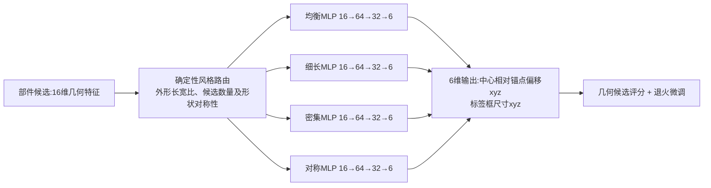

# 第一轮训练、系统架构与下一阶段偏好学习

> 2026-09-18。本文保留第一轮早期训练记录，其中“下一阶段尚未实现”的描述属于当时状态。当前权威实现已经升级为 51 维五视角 MLP、六图外部评分、run_id 隔离的奖励模型闭环和无泄漏 v4 候选；请以 [程序架构图](程序架构图.md)、[固定标签五视角训练与偏好架构](固定标签五视角训练与偏好架构.md) 和 [人工调整后标注来源与尺寸泄漏审计](人工调整后标注来源与尺寸泄漏审计.md) 为准。

## 系统架构（实线：已实现；虚线：计划）

```mermaid
flowchart LR
  D[55个OBJ及人工标注] --> X[固定分层划分<br/>train 33 / val 11 / test 11]
  X --> C[去掉label/leader<br/>clean OBJ]
  C --> G[按部件组生成候选<br/>锚点、初始中心及尺寸]
  X --> T[监督训练<br/>train人工布局]
  G --> T
  T --> M[四风格MLP权重<br/>experiments/layout_model.json]
  M --> S[train类别先验<br/>标签数量及group优先级]
  G --> S
  S --> R[几何风格路由<br/>选择一个MLP]
  R --> P[回归标签中心偏移和尺寸]
  P --> H[手写FNN/GNN/CNN/Transformer候选评分<br/>无可训练卷积或注意力权重]
  H --> O[双目模拟退火 / 规则式基线]
  O --> J[标签JSON + 带标签OBJ<br/>几何指标OLR/LCD/DBV]
  J --> V[WebGL主视角和多视角]
  V --> Q[人工A/B 或 外部GPT视觉维度评分]
  Q -.下一阶段: 多轮弱监督/人工复核.-> F[偏好对 + 评分日志<br/>只用train优化; val选择]
  F -.-> W[偏好评分器重排序<br/>或更新基础模型]
  W -.-> O
  X --> Z[冻结test集: 仅最终推理/评估]
  J --> Z
```



当前浏览器只负责展示、拍摄主视角和表单；Node 服务负责数据读取、模型预测、优化和外部视觉评分请求。GPU/深度学习框架不是第一轮训练前提。

## 第一轮网络的真实构成与依据



- 输入 16 维：归一化锚点 xyz、候选初始中心 xyz、候选框尺寸 xyz、源部件数、目标部件数、中心距离、物体包围盒尺寸 xyz、候选索引。每个位置/尺寸以包围球半径归一化，使不同物体尺度可共享权重。
- 每个 MLP 两层 tanh 隐层、线性输出；单专家约 3,366 个权重/偏置，四专家约 13,464 个。以人工标签的中心偏移和框尺寸作为六维监督目标，使用逐维均方误差和手写反向传播；每 epoch 随机打乱。风格路由是规则式 argmax，不是学习出的 softmax MoE。
- train 样本学习每类别平均标签数及组先验，推理时选择 clean OBJ 候选；val 选取每个专家最佳 epoch 的权重；test 的人工标注不参与梯度或权重选择，只在最终评估时用于误差指标。随后双目模拟退火将可读性、重叠、越界、引导线交叉和视差等几何目标做约束优化。
- 为何先用小型 MLP：每类别仅 3 个训练物体、总计 248 条训练标签，直接训练体素 CNN / Transformer 缺乏数据支撑。候选本身已有部件组和几何特征；先把可复现的监督回归与优化解码跑通，后续扩大数据、加消融，再考虑学习式 GNN/体素/注意力专家。
- `lib/model-adapter.mjs` 中名为 FNN/GNN/CNN/Transformer 的四路评分是手写函数与固定混合权重，不是上述训练出的四个 MLP，也没有实际的图消息传递/卷积/注意力权重更新。配置文件 `experiments/model-v1.json` 中的层数描述属于将来架构设想，不能作为第一轮训练网络实参。

## 首轮实验协议和产物

固定划分：11 类，每类 train/val/test = 3/1/1；train/val/test 标签数 248/80/78；训练 80 epochs，学习率 0.003、权重衰减 0.0001、seed 17。以 train 的六维目标均值作为无输入基线。完整指标、每种风格的最佳轮次和样本匹配情况见 `experiments/layout_training_report.json`，训练权重见 `experiments/layout_model.json`；上次权重保存在 `experiments/layout_model_before_round1.json`。

该 MSE 衡量监督的几何回归，不衡量画面美观、遮挡、人类偏好或 GPT 一致性。11 个 test 样本的推理产物在 `experiments/artifacts/round1/`；同参数 benchmark 在 `experiments/benchmarks/round1-trained/` 和 `round1-no-model/`，每组 11 × 6 条，并需分别报告重叠/可读性代理指标和耗时，不应把它们当真实人工主观分。当前数据集小，尤其均衡/对称风格样本不足，不能声称泛化至未见类别。

复现命令（在项目根目录）：

```powershell
npm run dataset:validate
npm run train:layout -- --epochs 80 --seed 17 --output experiments/layout_model_multiview_projection_candidate.json
npm run artifacts -- --split test --group all --size relative --optimizer annealing --seed 17 --iterations 80 --output experiments/artifacts/round1
npm run benchmark -- --split test --seed 17 --iterations 80 --model trained --output experiments/benchmarks/round1-trained
npm run benchmark -- --split test --seed 17 --iterations 80 --model none --output experiments/benchmarks/round1-no-model
```

## 外部 GPT 接入

启动 `npm start`，打开本地工作台的“外部 GPT 视觉评分连接”，填写 **完整 Responses API URL**（OpenAI 官方端点可填 `https://api.openai.com/v1/responses`）、**模型 ID**（必须有图片输入与 JSON Schema 结构化输出能力）和 **API Key**。保存后本次 Node 进程内生效；GET 设置接口不回显密钥，刷新/重启后需重新输入。也可启动前设置 `OPENAI_API_KEY`、`OPENAI_MODEL`，可选 `OPENAI_API_URL`。页面提供的是评分服务接入，不是把基础布局网络上传到外部模型训练。

请先生成布局，再点击“请求 GPT 视觉评分”：前端发送原始及标签结果主视角 JPEG、布局和几何指标；服务端请求 Responses API 并校验八项 1–5 分（可读性、覆盖、遮挡、平衡、双目、尺寸、分组、综合分），评分结果进入 `experiments/evaluations.jsonl`，不写原始截图与密钥。仅有主视角不能证明双目视觉质量：双目评分目前依赖几何指标，下一阶段应另附左右视角截图。没有 Key 不发请求，不生成伪造评分。第三方兼容端点须实现 Responses API 而非只兼容 Chat Completions。只给自己信任的服务商地址发送密钥与数据；不要公开本地服务或把密钥写进项目文件。

## 下一阶段设计记录（当前代码已实现自动闭环；真实外部轮仍需有效 Key）

1. 从**训练集**每个 OBJ 的第一轮模型权重出发，固定候选标签库与视角，改变退火种子/分组/尺寸等生成 3–5 个不同布局；每个布局保存模型版本、随机种子、标签 JSON、主视角 JPEG/PNG 路径和几何指标。不同布局必须分别实际渲染和拍摄，不能复用同一截图。
2. 将同一物体的多张主视角图分别给视觉评分器，标明同一评测量表，保存八维 1–5 分、模型 ID、响应 ID、评审时间和评分理由。补充左右眼图时再评双目稳定性；抽样人工复核，避免单次 GPT 分数成为唯一真值。收集人工 A/B 偏好，保证成对布局来自相同物体与视角。
3. 仅用 train 偏好对训练当前 `pairwise_mlp` 奖励评分器（或后续真正可微的布局策略）；把 GPT 连续评分视作弱监督，人工偏好作为主信号。每轮由偏好评分器重排序多个退火种子生成结果；如果要更新布局 MLP 权重，必须另外实现针对布局参数的可微损失/策略梯度，当前奖励评分器并不会自动改动基础模型。
4. 每轮只用 val 选择模型/停止条件，固定评分量表和截图相机；记录相对于第 0 轮的偏好胜率、几何指标、生成耗时以及人工盲评一致性。冻结之后在 test 一次性推理评估；绝不能把 test 的 GPT 反馈回灌训练。

当前代码已有人工 A/B 偏好记录、`train:preference` 的 pairwise MLP 及生成时四种退火种子的偏好重排序；没有“自动生成多个布局并批量截主视角/送 GPT/循环更新基础 MLP”的端到端脚本，也没有可声称已完成的多轮 GPT 偏好优化结果。
