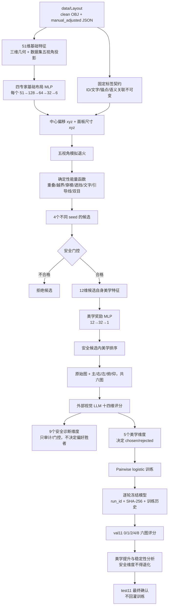

# 美学偏好与几何安全职责分离（2026-09-19）

本文是当前 LLM 偏好训练的权威设计。历史十二维混合偏好、36/45/49 维奖励输入仅保留作实验追溯，不再用于新的正式运行。

## 设计结论

系统把“能不能用”和“是否好看”拆成两条独立路径：

- 基础布局网络学习人工调整后的中心偏移与面板尺寸，负责给出合理初始布局。
- 确定性五视角能量函数处理标签重叠、越界、穿模、物体遮挡、文字清晰度、引导线交叉、跨视角差异和双目稳定。
- LLM 只在通过安全筛选的候选之间学习美学偏好。人工风格是一项参考，不要求复制人工最终坐标。
- 奖励模型不能越过安全门控选择一个“更好看但更危险”的候选。

## 系统架构

## 三层模型各自学习什么

### 1. 基础布局 MLP

活动网络仍为四个风格专家，每个结构是 `51→128→64→32→6`。输出为相对固定锚点的中心偏移 `xyz` 与面板尺寸 `xyz`。监督目标来自 55 份 `version=after_mannual_adjust`、`layout_type=manual_adjusted` 的人工调整后 JSON；调整前图像不是监督目标。

### 2. 确定性五视角能量函数

能量函数在数据集统一相机协议下计算：主、右、左、俯、仰，750×500，50 mm 焦距、36×24 mm 传感器、距离 10、主方向 `[1,1,1]`、扰动 ±45°。其职责包括：

- 标签—标签重叠与遮挡；
- 标签越出视口；
- 引导线交叉；
- 标签遮挡物体、物体遮挡标签；
- 五视角深度穿模代理和网格表面相交；
- 文字像素高度、容纳度和裁切；
- 跨视角方差与双目不稳定；
- 过长的锚点—标签距离。

### 3. LLM 美学奖励 MLP

奖励网络结构为 `12→32→1`。12 维输入全部由候选自身计算，不读取人工最终中心或尺寸，也不直接输入 GPT 分数：

1. 标签数量；
2. 语义类别数量；
3. 平均引导线距离；
4. 候选自身空间平衡；
5. 候选自身尺寸一致性；
6. 径向分布均值；
7. 径向分布离散度；
8. 引导线长度均值；
9. 引导线长度离散度；
10. 标签间距一致性；
11. 文字对应尺寸适配；
12. 构图和谐代理。

穿模、遮挡、越界、重叠、文字清晰度和几何能量不再作为奖励网络输入，以免奖励网络重复学习能量惩罚。

## 外部 LLM 的十四维评分

九个维度只作安全诊断：

`text_clarity`、`coverage`、`label_label_occlusion`、`object_occlusion`、`object_penetration`、`leader_line_clarity`、`multiview_consistency`、`binocular_consistency`、`size_consistency`。

五个维度用于产生偏好：

| 美学维度 | 权重 | 含义 |
|---|---:|---|
| `overall` | 0.30 | 整体美感与专业观感 |
| `composition_harmony` | 0.25 | 标签、引导线、物体轮廓和负空间的协调性 |
| `visual_hierarchy` | 0.20 | 主次层级和浏览顺序 |
| `spatial_balance` | 0.15 | 视觉重心、疏密和留白 |
| `manual_style_similarity` | 0.10 | 与人工调整后视觉语言的相似度，但不机械复制坐标 |

偏好综合分为上述五项加权和。九个安全分不会进入 chosen/rejected 加权，但会在 val 趋势报告中检查是否退化。

## 推理安全策略

四个退火候选先选网格表面相交最少、其次深度穿模最少、再比较总能量的候选作为安全参考。其他候选必须同时满足：

- 综合几何能量相对增加不超过 30%（软性容差；过窄的 1% 会使 train 候选对全部耗尽）；
- 标签之间的平均遮挡增加不超过 0.01，最差视角 OLR 增加不超过 0.03；
- 标签遮挡物体增加不超过 0.01；
- 物体遮挡标签增加不超过 0.06，且绝对比例不能超过 0.10；
- 深度穿模增加不超过 0.005；
- 网格表面相交增加不超过 0.005；
- 最差视角越界增加不超过 0.01；
- 文字清晰度下降不超过 0.10。

只有通过这些条件的候选才进入 `12→32→1` 美学奖励排序。至少保留安全参考候选，因此奖励模型不能造成无安全候选的情况。训练也只从同一安全门控内的候选形成偏好对。

## 训练记录与模型写入

每次正式运行均生成独立 `run_id`，并记录候选的十四维评分、响应凭据、chosen/rejected、美学分差、逐 epoch loss、逐轮冻结模型 SHA-256、val11 门控、0/1/2/4/8 趋势和 test11 最终确认。

训练先写 `experiments/preference_model_candidate.json`。只有美学代理提升且全部安全限制通过时，才备份旧活动奖励模型并写入 `experiments/preference_model.json`。基础布局模型 `experiments/layout_model.json` 不会被偏好训练覆盖。

## BinoForce/Hedgehog 比较边界

BinoForce/Hedgehog 使用同一数据集复现相机和同一 test11 几何指标比较。它们的确定性几何指标与外部 LLM 的 1–5 美学分量纲不同，必须并列报告，不能直接相减。统一结果在 `experiments/comparisons/round1/comparison.json` 与 `paired_bootstrap.csv`。

## 2026-09-19 中止运行

旧混合目标的正式 8 轮运行 `349df2a5-7639-4f1a-9133-ca3931c71592` 在第 0 轮完成 4/11 个 val 样本后中止。原因是用户明确要求 LLM 主要学习美观，旧协议却让安全维度直接参与偏好胜者。该运行没有产生 train 偏好、没有训练奖励模型、没有修改活动模型；四条旧协议评分只保留作中止审计，不能与新十四维运行合并。
